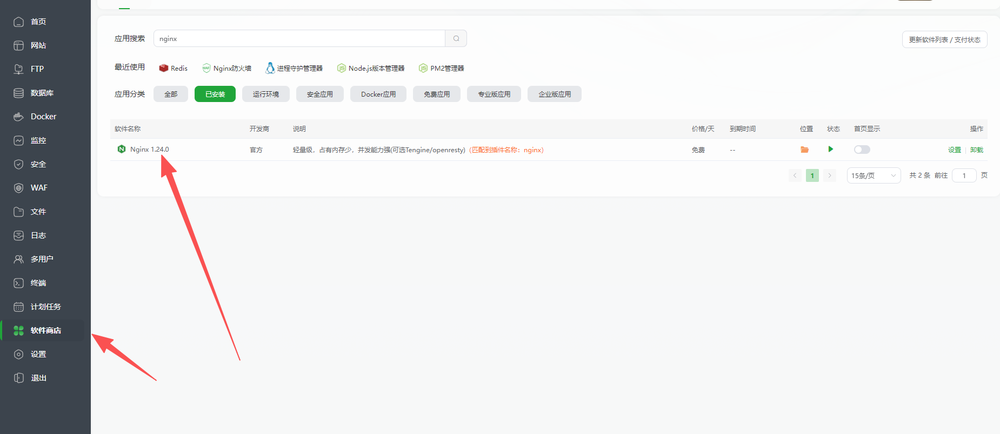
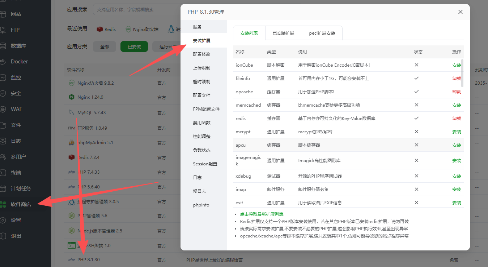
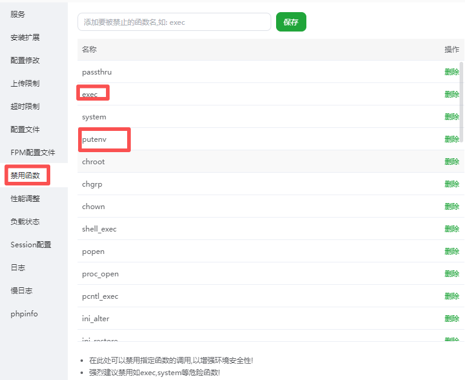
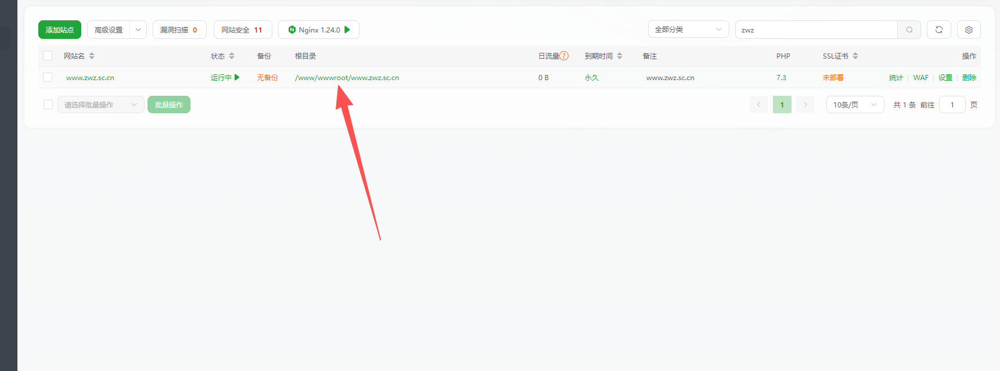
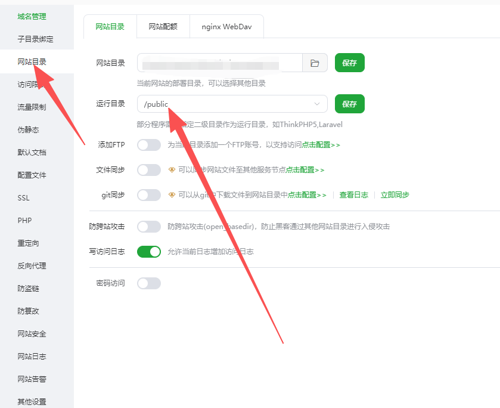
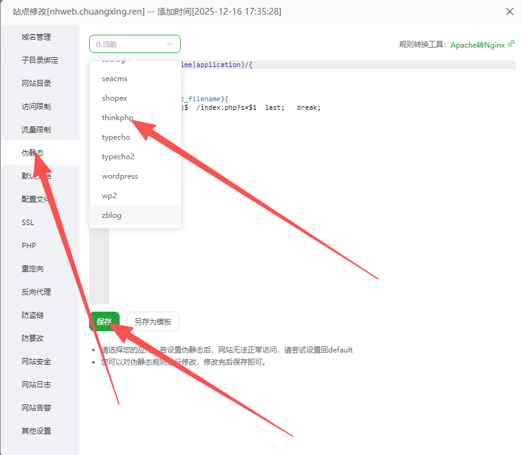
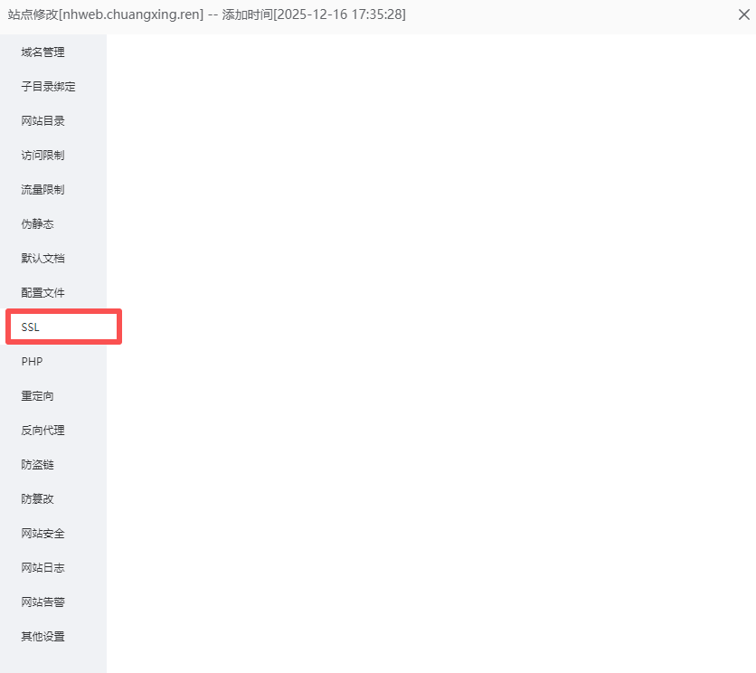

# NexusHive 宝塔面板部署指南

本文档详细介绍如何在宝塔面板上部署 NexusHive 低空智能飞行调度平台。

## 一、环境要求

### 1.1 服务器配置建议

| 配置项 | 最低要求 | 推荐配置 |
|--------|----------|----------|
| CPU | 2核 | 4核+ |
| 内存 | 4GB | 8GB+ |
| 硬盘 | 50GB SSD | 100GB+ SSD |
| 带宽 | 5Mbps | 10Mbps+ |
| 系统 | CentOS 7.x / Ubuntu 20.04 | CentOS 7.9 / Ubuntu 22.04 |

### 1.2 软件环境

| 软件 | 版本要求 |
|------|----------|
| PHP | >= 8.0.2 (推荐 8.1+) |
| MySQL | 5.7+ (推荐 8.0) |
| Redis | 6.2+ |
| Nginx | 1.18+ |
| Node.js | >= 20.19.0 (推荐 22.x) |
| EMQX | 4.4+ |

### 1.3 PHP 扩展要求

- bcmath
- iconv
- json
- gd
- fileinfo
- openssl
- mbstring
- pdo_mysql
- redis
- zip

## 二、宝塔面板安装

### 2.1 安装宝塔面板

请到宝塔官网详细查看宝塔面板安装教程

安装完成后，记录面板地址、用户名和密码。

### 2.2 安装必要软件

登录宝塔面板，进入「软件商店」安装以下软件：

1. **Nginx** - 选择最新稳定版
2. **MySQL** - 选择 5.7 或 8.0
3. **PHP** - 选择 8.1 或 8.2
4. **Redis** - 选择 6.x 或 7.x



### 2.3 PHP 扩展配置

进入「软件商店」→「PHP-8.x」→「设置」→「安装扩展」，安装以下扩展：

- fileinfo
- redis
- opcache (可选，提升性能)



### 2.4 PHP注意事项

进入「软件商店」→「PHP-8.x」→「设置」→ 「禁用函数」
删除以下
- putenv
- proc_open
- exec



## 三、项目部署

### 3.1 创建站点

1. 进入「网站」→「添加站点」
2. 填写域名（如：`nexushive.yourdomain.com`）
3. 选择 PHP 版本为 8.1+
4. 创建数据库，记录数据库名、用户名、密码


### 3.2 上传项目文件

方式一：通过宝塔文件管理器上传压缩包并解压




### 3.3 设置运行目录

进入「网站」→ 点击站点名称 →「网站目录」：

- **运行目录**：选择 `/public`
- **防跨站攻击(open_basedir)**：关闭或添加必要目录



### 3.4 配置伪静态

进入「网站」→ 点击站点名称 →「伪静态」，填入以下规则：

```nginx
location ~* (runtime|application)/{
    return 403;
}

location / {
    if (!-e $request_filename){
        rewrite  ^(.*)$  /index.php?s=$1  last;
        break;
    }
}
```



### 3.5 配置 .env 文件

通过安装器安装已自动配置，请安装完成后去根目录查看修改 env.md有注释各项配置

### 3.6 安装 Composer 依赖

在「终端」中执行：

```bash
cd /www/wwwroot/nexushive.yourdomain.com
composer install
```

### 3.7 设置目录权限

未开启安全管理可以不用处理，需要处理请先777然后755

### 3.8 导入数据库

通过安装器安全已自动导入，无需再次导入，若手动导入请到deploy\docker\db-init下找到sql文件进行导入之后根据env.md配置env文件

### 3.9 创建安装锁文件

如果已手动导入数据库，需要创建安装锁文件跳过安装向导：

```bash
touch /www/wwwroot/nexushive.yourdomain.com/public/install.lock
```

### 3.10 访问测试

在浏览器访问你的域名，应该能看到安装器页面：


## 四、Workerman 守护进程配置

NexusHive 使用 Workerman 处理 WebSocket 连接和实时通信，需要配置守护进程。

### 4.1 使用宝塔 Supervisor 管理器

1. 在「软件商店」搜索并安装「Supervisor管理器」


<!-- 截图说明：软件商店中安装 Supervisor 管理器 -->

2. 进入 Supervisor 管理器，点击「添加守护进程」：

| 配置项 | 值 |
|--------|-----|
| 名称 | nexushive-worker |
| 启动用户 | www |
| 运行目录 | /www/wwwroot/nexushive.yourdomain.com |
| 启动命令 | think worker:server |
| 进程数量 | 1 |

3. 点击「确定」并启动进程

## 五、EMQX 安装配置

### 5.1 安装 EMQX

```bash
# CentOS 7
wget https://www.emqx.com/zh/downloads/broker/4.4.19/emqx-4.4.19-otp24.3.4.2-1-el7-amd64.rpm
rpm -ivh emqx-4.4.19-otp24.3.4.2-1-el7-amd64.rpm

# Ubuntu
wget https://www.emqx.com/zh/downloads/broker/4.4.19/emqx-4.4.19-otp24.3.4.2-1-ubuntu20.04-amd64.deb
dpkg -i emqx-4.4.19-otp24.3.4.2-1-ubuntu20.04-amd64.deb
```
请到emqx官方获取安装教程及配置教程进行正确配置或直接在宝塔软件商城进行安装


### 5.2 配置 EMQX

访问 EMQX Dashboard：`http://服务器IP:18083`
- 默认用户名：admin
- 默认密码：public

建议操作：
1. 修改默认密码
2. 配置认证插件
3. 开放必要端口（1883, 8083, 8084）

### 5.3 防火墙配置

在宝塔「安全」→「防火墙」中放行以下端口：

| 端口 | 用途 |
|------|------|
| 1883 | MQTT TCP |
| 8083 | MQTT WebSocket |
| 8084 | MQTT WebSocket SSL |
| 18083 | EMQX Dashboard |

### 5.4 验证 MQTT 连接

使用 MQTTX 工具测试连接，MQTTX请到官方下载

## 六、SSL 证书配置

### 6.1 申请证书

进入「网站」→ 点击站点名称 →「SSL」：

1. 选择「Let's Encrypt」免费证书
2. 勾选域名，点击申请
3. 开启「强制HTTPS」




## 八、常见问题

### 8.1 502 Bad Gateway

**可能原因：**
- PHP 服务未启动
- PHP 版本不正确

**解决方案：**
1. 检查 PHP 是否正常运行
2. 确认站点 PHP 版本 >= 8.0
3. 查看 PHP 错误日志：`/www/wwwlogs/站点名.php-error.log`

### 8.2 页面空白

**可能原因：**
- runtime 目录无写入权限
- PHP 扩展缺失

**解决方案：**
1. 设置 `runtime` 目录权限为 777
2. 开启 `APP_DEBUG = true` 查看详细错误
3. 检查 PHP 扩展是否完整安装

### 8.3 Workerman 无法启动

**可能原因：**
- 端口被占用
- PHP CLI 路径错误

**解决方案：**
1. 检查端口占用：`netstat -tlnp | grep 2346`
2. 确认 PHP CLI 路径：`/www/server/php/81/bin/php -v`
3. 查看 Supervisor 日志

### 8.4 MQTT 连接失败

**可能原因：**
- EMQX 服务未启动
- 防火墙端口未开放

**解决方案：**
1. 确认 EMQX 运行状态：`emqx_ctl status`
2. 检查防火墙端口
3. 使用 MQTTX 工具测试连接

### 8.5 无法检测到更新

**可能原因：**
- 客户端ID配置错误
- 授权平台客户端被禁用

**解决方案：**
1. 检查 `.env` 中的 `UPDATER_CLIENT_ID` 配置
2. 确认授权平台地址正确
3. 在授权平台检查客户端状态

如有问题，请加入交流群获取支持。
